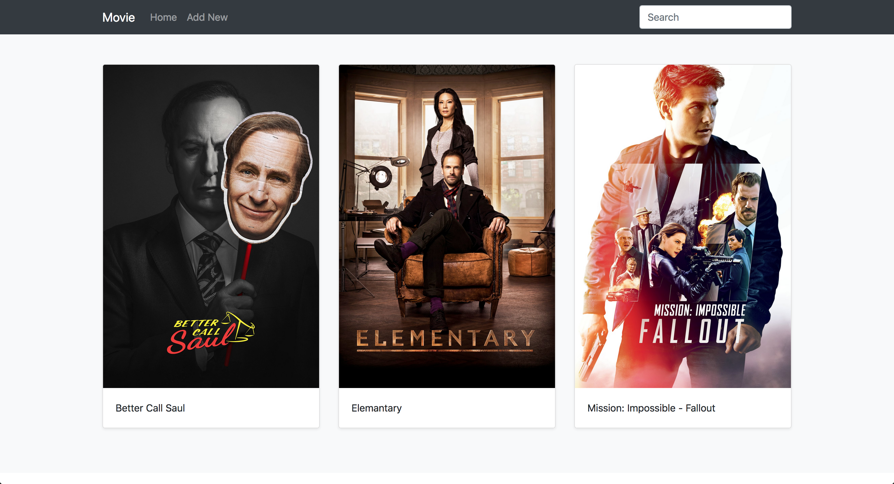

# AppRun Movie App

AppRun is a 3K library for developing applications using the elm inspired architecture, events and components. https://apprun.js.org 

To start front-end application (AppRun)
```
git clone https://github.com/arnakoguzhan/apprun-movie.git

cd apprun-movie
npm install
npm start
```

To start backend app 

```
cd backend
npm install
npm start
```

## Demo


